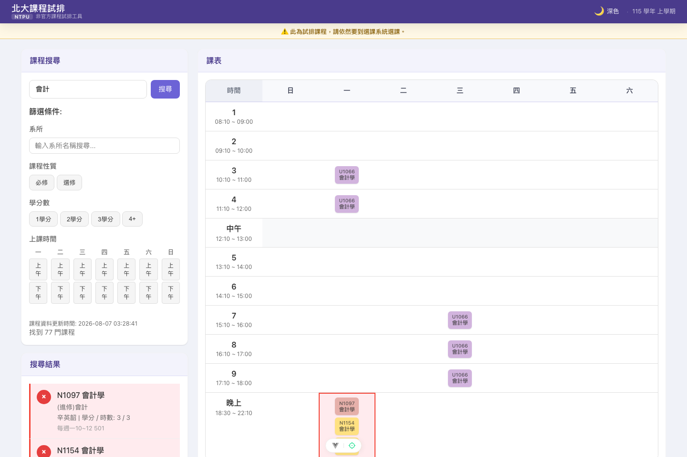
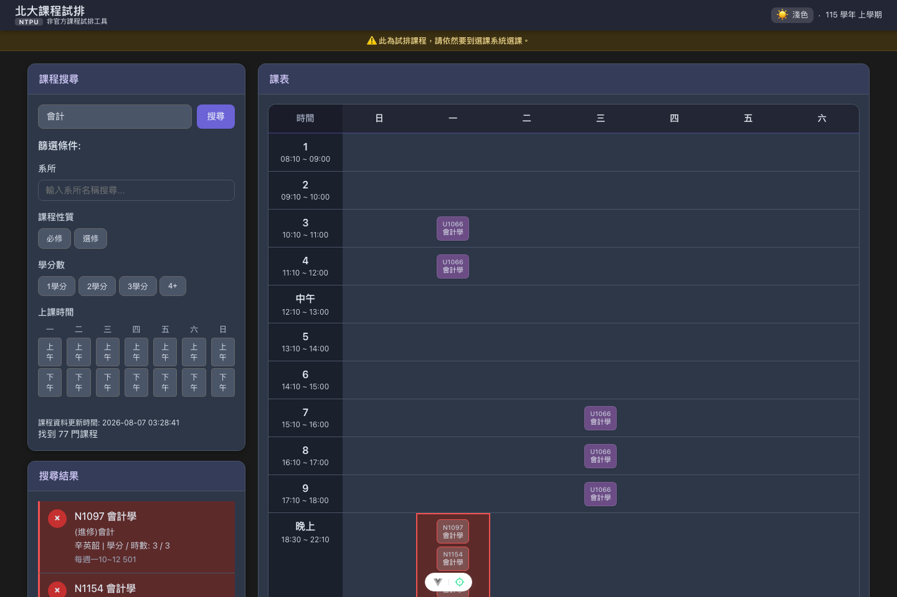

# 使用說明

[北大課程試排](https://ntpu-timetable.littlechin.tw)（NTPU Timetable）是一個給國立臺北大學（NTPU）學生試排課表用的小工具。你可以在正式選課前，先搜尋課程、篩選條件、把想上的課加進課表，看看時間有沒有衝堂，安排出理想的課表之後，再到學校官方選課系統實際選課。

> ⚠️ **這不是官方選課系統**，這裡的「選課」不會真的幫你選到課，僅供試排參考。資料來源為北大教務系統，但不保證完全正確即時，請以官方選課系統及公告為準。

## 搜尋課程

在左上角「課程搜尋」欄位輸入關鍵字，按 Enter 或點「搜尋」按鈕即可查詢。關鍵字可以是：

- 課程編號（例如 `U1066`）
- 課程名稱（例如 `會計學`）
- 教師姓名（例如 `邱碩志`）
- 開課或開放修課的系所（例如 `會計系`、`資訊工程學系`）

搜尋只需符合其中任何一項即可，不分大小寫。可以用空白隔開多個關鍵字，例如 `資工 演算法` 會找出同時符合兩個詞的課程。

搜尋結果依課號排序，一次先顯示 50 筆，按列表底部的「顯示更多」可以繼續往下看。

## 篩選條件

在搜尋框下方可以疊加篩選條件，篩選規則是：

- **同一類別內是「或」關係**：例如同時勾選「必修」和「選修」，會顯示必修**或**選修的課。
- **不同類別之間是「且」關係**：例如同時選了系所「會計系」和「必修」，只會顯示「會計系的必修課」。

可篩選的類別：

| 類別 | 說明 |
| --- | --- |
| 系所 | 輸入或從清單選擇一個「開放修課」的系所加入篩選（例如「資工系」，不含年級） |
| 年級 | 1～5 年級，會和系所一起判斷，例如「資工系 + 1年級」只顯示資工系一年級開放的課 |
| 課程性質 | 必修 / 選修 / 通識。教育學程的「教必」「教選」分別歸入必修、選修 |
| 學分數 | 0 / 1 / 2 / 3 / 4 學分以上 |
| 上課時間 | 依「星期 + 上午／下午／晚上」勾選，例如「週三晚上」。上午為第 1～4 節、下午第 5～9 節、晚上第 10 節以後 |

系所、年級、課程性質三者是針對「同一筆開放修課資訊」一起判斷的：一門課對甲系是必修、對乙系是選修時，選「乙系 + 必修」不會出現這門課。

套用上課時間篩選時，上課時間尚未公告的課程無法判斷時段，因此不會列出；搜尋結果提示會告訴你有幾門這類課程被排除，取消時間篩選即可看到。

已套用的篩選條件會顯示在篩選區上方，每個條件旁邊都有 `×` 可以單獨移除；也可以按「清除所有篩選」一次清空。

## 加入 / 移除課程

- 在「搜尋結果」列表中，點課程列左側的 **➕** 按鈕，就會把課程加入右側課表與「已選課程」清單。
- 已經加入的課程，同一個按鈕會變成 **❌**，再點一次即可移除。
- 點課程列本身（不是按鈕）會彈出該課程的詳細資訊，包含完整上課時間、教室、備註、以及原始資料。
- 「已選課程」卡片下方的「清除所有課程」可以一次清空目前排好的所有課程，重新開始。

## 衝堂提醒

如果一門課的上課時間跟你已經加入的課程重疊，會用紅色標示提醒你：

- 搜尋結果中，衝堂的課程列會顯示淡紅色底、左邊有紅色色條。單週課與雙週課排在同一時段不算衝堂。
- 課表上，衝堂的時段格子會顯示紅色外框。

有衝堂標示不代表不能加入，只是提醒你留意時間安排，實際能不能選課仍以學校選課系統的規則為準。

## 課表與學分/時數統計

右側課表會即時顯示目前排好的所有課程，不同課程會自動配色方便辨識。「已選課程」卡片標題旁會顯示目前總學分與總時數，方便確認是否超過或低於預計修習的學分數。

## 深色模式

點右上角「深色 / 淺色」按鈕即可切換主題，選擇會記住在瀏覽器裡（`localStorage`），下次打開網頁會維持你上次的選擇；若從未手動切換過，會依照系統的深色模式設定自動決定。

## 課程資料多久更新一次？

課程資料由自動化程式定期從北大課程查詢系統抓取，一週會更新幾次（週二、四、六），更新時間會顯示在搜尋框下方的「課程資料更新時間」。如果剛好在加退選、課程異動期間，資料可能會有些延遲，請以官方選課系統的即時資訊為準。

### 已選課程若被停開或改時間怎麼辦？

因為課程資料會定期重新抓取，你之前排進課表的課程，可能在這之間被停開、下架，或者上課時間/教室/學分/授課教師有變動。每次打開網頁時，系統會自動比對你已選的課程和最新的課程資料：

- 如果某門課**已經找不到**（可能停開或課號變動），會直接從課表移除。
- 如果某門課**內容有變動**（時間、學分、時數、教師或課名不同），也會從課表移除，避免你看到的是過期資訊。

被移除的課程會用一個「課程異動通知」視窗列出來，並且盡量顯示「異動前」與「異動後」的內容對照，方便你知道發生了什麼變化，再重新搜尋確認後加入正確的課程。

## 已選課程存在哪裡？會不會不見？

已選課程只存在**你目前使用的瀏覽器**裡（`localStorage`），並沒有帳號系統，也不會同步到別的裝置或瀏覽器。清除瀏覽器資料、換裝置、換瀏覽器都會導致排好的課表消失，請自行留意（例如排好後拍照或截圖記錄）。

## 問題回報

- 使用上的問題或建議：歡迎寄信到 `ntpu-timetable-support@googlegroups.com`
- 程式錯誤（bug）或功能建議：歡迎到 [GitHub Issues](https://github.com/littlechintw/NTPU-Timetable/issues) 開票
